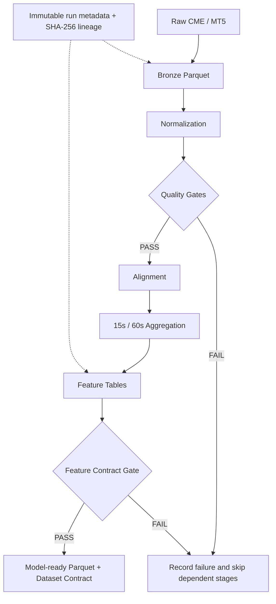

# Polarix · Financial Data Pipeline

[](https://github.com/alinoori7723/polarix-financial-data-pipeline/actions/workflows/ci.yml)
[](pyproject.toml)
[](LICENSE)

**Turn heterogeneous market events into quality-checked, traceable feature tables.**

Polarix processes CME reference trades and MT5 quote telemetry through explicit timestamp contracts, quality gates, and dependency-aware execution. Every demo run carries immutable metadata, artifact hashes, stage outcomes, and an explicit feature schema. A deterministic synthetic dataset makes the complete pipeline reproducible on a laptop.

**Polars · DuckDB · Apache Parquet · PyArrow · Python · GitHub Actions**

## Pipeline architecture



The offline demo uses synthetic inputs in the same schemas as the source adapters. It calls the normalization, quality, alignment, and feature-building modules directly. Aggregation and feature derivation execute together in one stage.

## Run it

Requires Python 3.11+ and [uv](https://docs.astral.sh/uv/). Windows and Linux are covered by CI.

```bash
git clone https://github.com/alinoori7723/polarix-financial-data-pipeline.git
cd polarix-financial-data-pipeline
uv sync --frozen
uv run --frozen polarix demo --run-id demo-001
uv run --frozen polarix inspect .polarix/runs/demo-001
```

The demo generates 20 minutes of synthetic events with seed `42`. It needs no credentials, paid data, terminal, or network access after dependency installation. Use a new run ID for another execution; existing runs cannot be overwritten.

Expected feature-table counts:

| Symbol pair | 15-second rows | 60-second rows |
|---|---:|---:|
| ES / SPX500 | 80 | 20 |
| NQ / NDX100 | 80 | 20 |

`inspect` verifies recorded SHA-256 hashes before querying the exported Parquet with DuckDB. Output includes stage decisions, elapsed time, partition counts, and join-safe ratios. See [a captured synthetic run](examples/demo-summary.json).

```text
.polarix/runs/demo-001/
├── metadata.json
├── bronze/
├── silver/
├── gold/
├── reports/
├── stages/
├── dataset/
│   ├── model_features.parquet
│   └── dataset_contract.json
└── run_manifest.json
```

Exercise a rejection path:

```bash
uv run --frozen polarix demo --run-id bad-quotes --scenario crossed-quotes
uv run --frozen polarix inspect .polarix/runs/bad-quotes
```

The quality stage fails, dependent stages are skipped, and no feature dataset is published. Both commands return exit code `2`. The `invalid-timestamps` scenario exercises an earlier normalization failure.

## Engineering decisions

| Concern | Implementation |
|---|---|
| Reproducible storage | Partitioned Parquet; explicit Arrow schemas; Polars transformations; DuckDB read verification |
| Time correctness | Preserve source timestamps; normalize MT5 milliseconds using session metadata; retain CME nanoseconds; measure clock residuals |
| Lineage | Exclusive run directories; write-once JSON publication; configuration hash; dependency versions; file hashes and row counts |
| Failure propagation | Required predecessors must pass; upstream artifacts are checked before and after each stage; failures remain inspectable |
| Feature readiness | Explicit column roles; deterministic row identities; trailing statistics; closed-bucket export; finite numeric values and documented nulls |
| Validation | Synthetic integration tests, future-data invariance, publication races, stale lineage, timestamp ambiguity, and mocked adapter failures |

The [architecture notes](docs/architecture.md) explain the execution model and tradeoffs. The [data contracts](docs/data-contracts.md) define time units, feature availability, eligibility, and training boundaries.

## Code map

```text
src/polarix/
├── ingestion/
├── normalization/
├── quality/
├── alignment/
├── features/
├── orchestration/
└── common/
tests/
config/
docs/
scripts/
```

Useful entry points for a code review:

- [Stage execution and failure propagation](src/polarix/orchestration/runner.py), with [lineage and concurrency tests](tests/test_stage_runner.py).
- [Timestamp normalization](src/polarix/normalization/normalization.py) and [run metadata selection](src/polarix/orchestration/run_metadata.py).
- [Feature contracts](src/polarix/features/bar_feature_contract.py), [feature construction](src/polarix/features/bar_feature_builder.py), and [dataset export](src/polarix/features/dataset.py).
- [Complete synthetic pipeline tests](tests/test_demo_pipeline.py), including the guarantee that adding future events leaves earlier closed-bucket features unchanged.

## Development

```bash
uv sync --frozen --extra dev --extra analysis
uv run --no-sync ruff check .
uv run --no-sync ruff format --check .
uv run --no-sync pytest -q
uv build
```

CI tests Python 3.11 and 3.13 on Windows and Linux, runs the demo, publishes test reports, and smoke-tests the installed wheel outside the checkout. See [contributing](CONTRIBUTING.md) and [operations](docs/operations.md) for adapter configuration and multi-day processing.

## Scope and data

This is a local batch pipeline with optional vendor adapters. Its MLOps foundations are versioned features, reproducible configuration, lineage, and explicit dataset contracts. It does not include a trained model, model registry, serving system, or evidence of trading performance. Event-time feature timestamps alone do not establish live availability; production use needs an explicit late-arrival and watermark policy.

All distributed examples are synthetic. Licensed market data, account details, and run outputs are excluded from version control. The [data policy](docs/data-policy.md) covers external data use. Source code is available under the [MIT license](LICENSE).
